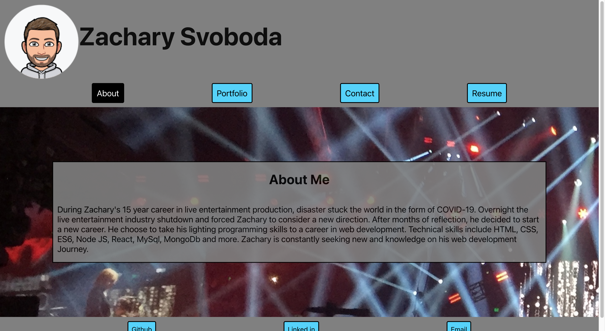

# Zsvoboda-Portfolio

## Description 
This Portfolio is an SPA built with React.  The page is designed by Zachary Svoboda and serves as a portfolio of the work he created.

## ScreenShot
Screen: 

## Table of Contents 

* [Installation](#installation)
* [Usage](#usage)
* [License](#license)
* [Contributing](#contributing)
* [Tests](#tests)
* [Questions](#questions)

## Installation
There is no installation process.  Go to https://zsvoboda87.github.io/zsvoboda-portfolio/ to view the SPA

## Usage 
The repo is available to be utilized by anyone.

## Contributing
Feel free to download or fork from the orginal and make your own changes.

## Tests
Current there is no testing instructions for this app.

## Questions
https://github.com/Zsvoboda87

Email Me @ svobodazachary@gmail.com

## License
MIT License
    
Copyright (c) 2022 Zachary Svoboda
      
Permission is hereby granted, free of charge, to any person obtaining a copy
of this software and associated documentation files (the "Software"), to deal
in the Software without restriction, including without limitation the rights
to use, copy, modify, merge, publish, distribute, sublicense, and/or sell
copies of the Software, and to permit persons to whom the Software is
furnished to do so, subject to the following conditions:
      
The above copyright notice and this permission notice shall be included in all
copies or substantial portions of the Software.
      
THE SOFTWARE IS PROVIDED "AS IS", WITHOUT WARRANTY OF ANY KIND, EXPRESS OR
IMPLIED, INCLUDING BUT NOT LIMITED TO THE WARRANTIES OF MERCHANTABILITY,
FITNESS FOR A PARTICULAR PURPOSE AND NONINFRINGEMENT. IN NO EVENT SHALL THE
AUTHORS OR COPYRIGHT HOLDERS BE LIABLE FOR ANY CLAIM, DAMAGES OR OTHER
LIABILITY, WHETHER IN AN ACTION OF CONTRACT, TORT OR OTHERWISE, ARISING FROM,
OUT OF OR IN CONNECTION WITH THE SOFTWARE OR THE USE OR OTHER DEALINGS IN THE
SOFTWARE.
